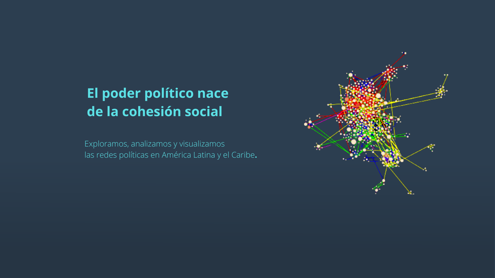

{fig-align="center"}

------------------------------------------------------------------------

## 🔎 Nuestra investigación

::: {.g-col-12 .g-col-md-6}
### <i class="fas fa-landmark"></i> 🌌 Redes políticas

Estudiamos las transformaciones del capital político en América Latina, desde las guerras de independencia del siglo XIX hasta la actualidad.
:::

::: {.g-col-12 .g-col-md-6}
### 🗳️ Candidaturas presidenciales

Analizamos el capital burocrático de los aspirantes a la presidencia en los procesos electorales.
:::

::: {.g-col-12 .g-col-md-6}
### 📊 Capital político

Investigamos cómo los actores políticos acumulan y emplean diversos recursos para transformar el prestigio y la posición en capacidad de influencia.
:::

------------------------------------------------------------------------
