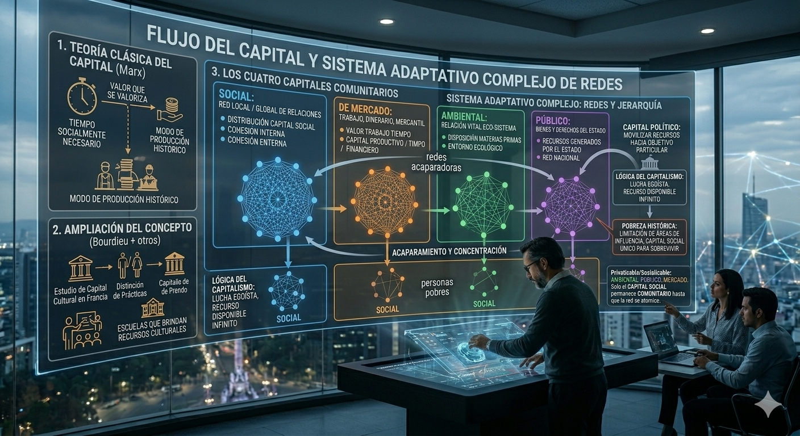

Marx describía el capital como "valor que se valoriza", entendiendo por "valor" la cantidad de tiempo socialmente necesario para producir una mercancía. Desde esta perspectiva, el capital no es una cosa, sino un proceso reiterativo a través del tiempo [@marx2011].

Pero Marx también definía el capital como un resultado del modo de producción histórico. Y esta definición puede extrapolarse a otras formas de relación social. Pierre Bourdieu retomó la noción marxista de capital para explorar otras formas de valor en espacios de interacción más acotados [@bourdieu2021]. Su estudio sobre el capital cultural en Francia, por ejemplo, muestra cómo las prácticas culturales de los individuos de una clase social los distinguen de aquellos que no tuvieron acceso a los recursos culturales que ofrecen ciertas escuelas.

Esta idea impulsó una profundización mayor en el concepto, derivando en lo que hoy conocemos como la Teoría del Capital Social. Desarrollada por investigadores posteriores a Bourdieu [@lin2001] [@hakim2010] [@alfredojoignant2014], esta teoría nos ayuda a comprender el valor de las relaciones sociales para el comportamiento colectivo en diferentes contextos culturales, materiales e históricos. Más tarde, la teoría de redes aportó la formalidad matemática que esta perspectiva necesitaba para poner a prueba hipótesis que antes solo se planteaban como metáforas.

Así, existen distintas formas de capital en tanto valor social[@ostrom2011], ya sea medido por tiempo de trabajo necesario (como en el económico), o en sus versiones emocional, vital o de dignidad. Para analizarlas, es necesario identificar diferentes áreas de influencia de la red:

- **Social**: la red local o global de relaciones donde se distribuye el capital social.

- **De mercado**: el capital en forma de trabajo, dinero y bienes mercantiles.

- **Ambiental:** la relación vital entre la red social y su entorno ecológico directo e indirecto.

- **Público**: los recursos generados por el Estado en forma de bienes y derechos para una red nacional.

{fig-align="center"}

La jerarquía que un sujeto o una red adquiere depende de su participación y disfrute de los diferentes recursos en cada una de estas áreas de influencia. En un sistema de dominación, por ejemplo, la concentración de recursos que logra una red local mediante el acaparamiento de distintos tipos de capital en cada área conduce también a una mayor concentración de capital político, el cual puede movilizar recursos de diferentes redes hacia un objetivo particular.

En el capitalismo, la capacidad de acaparar recursos en las cuatro zonas de influencia ha sido brutal. Esto se debe a que el sistema parte de la premisa de que todo recurso es disponible e infinito, y que, por lo tanto, se requiere una lucha entre individuos egoístas para obtener el máximo beneficio que de otra manera no podrían alcanzar. Bajo esta lógica, los capitalistas (dueños de los medios de producción) compiten por incrementar su capital productivo, financiero o mercantil, el cual está íntimamente vinculado con el capital ambiental para la disposición de materias primas.

Cuando su capital crece, también lo hacen sus áreas de influencia. Así logran convencer a las redes políticas que controlan el Estado para acaparar bienes públicos o monopolizar ciertos mercados. De esta forma, sus áreas de influencia se expanden y su posición en la jerarquía de la red se eleva, junto con su capital.

En contraste, una persona pobre es aquella cuyas áreas de influencia están históricamente limitadas, quedándole únicamente el capital social como recurso para sobrevivir. Y esto, siempre que cuente con una red familiar activa; de lo contrario, puede ser pobre también en capital social, situación que representa el mayor grado de vulnerabilidad existente.

En suma, la disposición de los cuatro capitales para una red incide directamente en la riqueza potencial que puede generar. Cuanto mayor sea el acceso a esos cuatro capitales, mayor será el poder de la red.

Tres de estos capitales pueden privatizarse o socializarse: el ambiental, el público y el de mercado. Solo el capital social permanece comunitario... hasta que la red se atomiza.
